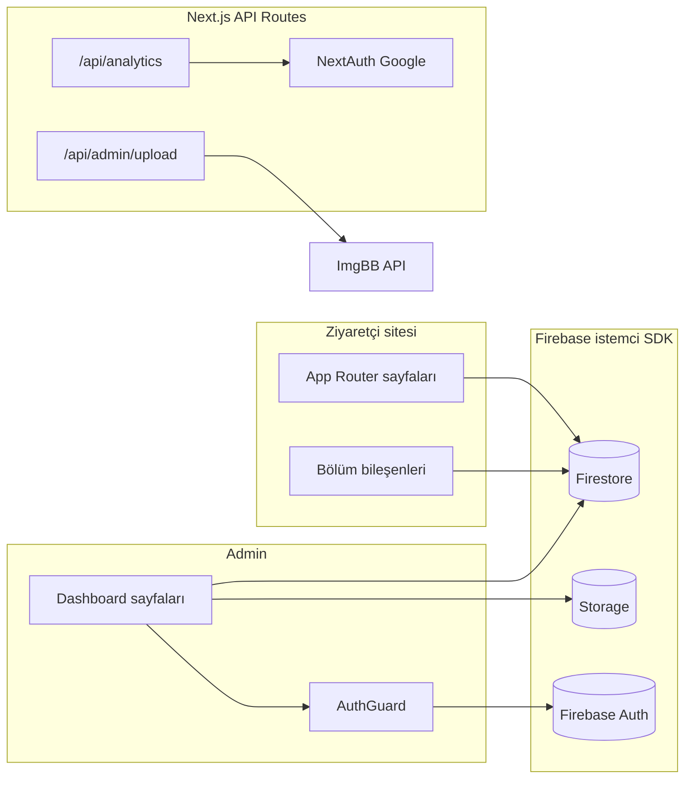

# Mimari özeti

## Genel görünüm

## App Router yapısı

| Klasör | Amaç |
|--------|------|
| `src/app/page.tsx` | Ana sayfa (hero, bento, portfolio, vb.). |
| `src/app/gallery/` | Galeri listesi ve `gallery/[category]` altında kategori bazlı fotoğraflar. |
| `src/app/privacy`, `terms`, `cookies` | Yasal sayfalar; içerik Firestore’dan veya varsayılan metinlerden. |
| `src/app/admin/` | Yönetim paneli: `login` ve `(dashboard)/…` altında alt sayfalar. |
| `src/app/api/` | Sunucu uçları: NextAuth, analytics, dosya yükleme. |

Kök `layout.tsx` içinde **ThemeProvider**, **AuthProvider** (NextAuth `SessionProvider`) ve **SEO** (`getSEOSettings`) uygulanır.

## Kimlik ve oturum (iki parça)

1. **Firebase Authentication** — Admin paneline giriş: e-posta/şifre veya Google popup (`AuthGuard` `onAuthStateChanged` ile korur). İçerik ve mesajlar Firestore üzerinden istemci SDK ile okunur/yazılır.
2. **NextAuth (Google OAuth)** — Özellikle **Analytics API** route’unda sunucu oturumu doğrulamak için kullanılır; JWT’de Google `access_token` saklanır (Drive okuma kapsamı dahil).

Bu ayrım, admin arayüzünün Firebase ile çalışırken analytics endpoint’inin NextAuth oturumu istemesinden kaynaklanır.

## Veri erişimi

- **Firestore:** `src/lib/firestore.ts` — koleksiyonlar ve `siteContent` alt dokümanları için merkezi fonksiyonlar.
- **Storage:** `src/lib/storage.ts` (Firebase Storage yükleme/silme).
- **İletişim formu:** Mesaj gönderimi Firestore REST API ile yapılır (istemci SDK izin sorunlarına karşı) — bkz. `submitContactMessage`.

## API route’ları

| Route | Amaç |
|-------|------|
| `/api/auth/[...nextauth]` | NextAuth yapılandırması. |
| `/api/analytics` | GA4 Data API; yalnızca geçerli NextAuth oturumu + `GA_*` env. |
| `/api/admin/upload` | ImgBB’ye yükleme; `IMGBB_API_KEY`. |
| `/api/admin/google-drive/upload` | Google Drive üzerinden içerik; ilgili env ve ImgBB. |

## Önemli istemci modülleri

- `src/store/adminStore.ts` — Admin UI durumu.
- `src/lib/firebase.ts` — Firebase uygulama örneği, `db`, `storage`, `auth`.
- `src/types/index.ts` — Firestore ile uyumlu TypeScript tipleri.
